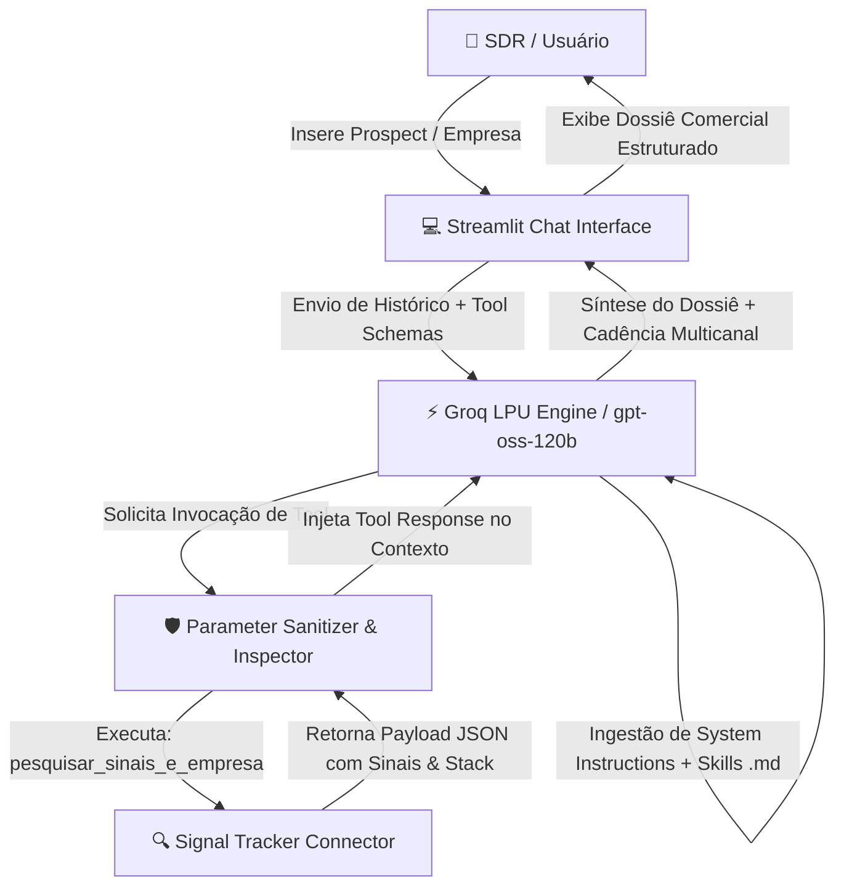

# 🎯 CoreSaaS Pre-Sales Manager — Agentic AI Copilot

[](https://www.python.org/)
[](https://streamlit.io/)
[](https://groq.com/)
[](https://opensource.org/licenses/MIT)

> **Agente Autônomo B2B de Inteligência Comercial e Pré-Vendas**, projetado para pesquisar prospects em tempo real, mapear sinais de mercado, estruturar diagnósticos de Buyer Personas e gerar cadências multicanal hiperpersonalizadas (E-mail, LinkedIn e Cold Call).

Link: https://core-saas-presales-manager-pqofo3pofqxjlhxxhmdrk2.streamlit.app/

> **Nota de Demonstração:** O link acima refere-se a um ambiente de testes criado exclusivamente para avaliação funcional da arquitetura do **CoreSaaS Pre-Sales Manager**. Todos os perfis de leads, dados de empresas, stacks tecnológicos e sinais de mercado utilizados são **100% sintéticos (*mock data*)**, projetados para simular cenários reais de prospecção B2B sem expor dados confidenciais ou violar a LGPD/GDPR.

---

## 💡 O Desafio B2B em Pré-Vendas & A Solução Agêntica

* **O Gargalo Operacional:** Pré-vendedores (SDRs/BDRs Sêniores) gastam de **15 a 30 minutos por prospect** navegando manualmente entre sites, LinkedIn e notícias para entender o momento da empresa, mapear dores do cargo e redigir abordagens personalizadas. O resultado é um volume baixo de abordagens ou o uso de *templates* genéricos de baixa conversão.
* **A Solução Agêntica Governada:** O **CoreSaaS Pre-Sales Manager** atua como um copilot de vendas de alta performance. Através de *Function Calling* de dois passos, o agente executa a ferramenta de pesquisa `pesquisar_sinais_e_empresa`, cruza os dados com uma **biblioteca especialista de habilidades comerciais** e sintetiza um **Dossiê Comercial Completo** com cadências acionáveis em menos de 5 segundos.

---

## 🧠 Biblioteca de Skills & Potencializador de Prospecção

O agente utiliza uma **arquitetura de habilidades desacopladas** em Markdown (`skills/`). Cada habilidade atua como um consultor especialista que orienta o orquestrador na condução do diagnóstico e da escrita comercial:

| Skill / Módulo | Função Prática na Prospecção | Impacto na Rotina Comercial |
| :--- | :--- | :--- |
| 🔍 **Signal Tracker** | Mapeia gatilhos temporais (vagas abertas, novas rodadas de investimento, expansão de equipe, trocas de gestão). | Permite abordagens baseadas em **timing perfeito** e eventos reais da conta. |
| 📊 **Commercial Research** | Consolida o modelo de negócio da empresa target, público-alvo, presença de mercado e concorrência. | Elimina a necessidade de navegação manual em múltiplos sites e bases de dados. |
| 🎯 **Framework Selector** | Seleciona automaticamente a metodologia ideal (SPIN Selling, BANT, CHAMP, Challenger, MEDDIC) conforme o perfil do prospect. | Garante rigor metodológico sem exigir que o SDR crie a estratégia do zero. |
| 🧩 **Product Advisor** | Faz o *cross-matching* entre as dores diagnosticadas do cargo e o portfólio de soluções SaaS. | Apresenta o produto diretamente como solução técnica para o problema identificado. |
| ✍️ **Outbound Copy** | Gera e-mails de alta conversão e mensagens de LinkedIn focadas na dor específica da persona. | Fim dos templates genéricos; mensagens hiperpersonalizadas prontas para envio. |
| 📞 **Cold Call Strategy** | Cria roteiros de ligação estruturados com ganchos de abertura, perguntas abertas e pitch de 20 segundos. | Prepara o pré-vendedor para reuniões com maior taxa de agendamento e menor atrito. |
| 🗓️ **Campaign Builder** | Estrutura a cadência temporal multicanal (*touchpoints* distribuídos ao longo dos dias). | Organiza a execução diária do SDR em um fluxo de prospecção lógico e replicável. |

---

## 🏗️ Arquitetura do Sistema & Fluxo de Dados (Two-Pass Tool Calling)

O sistema utiliza o padrão agêntico com **invocação de ferramentas em dois passos (*Two-Pass Synthesis*)**, garantindo a extração de dados antes da síntese final do modelo.



---

## 📋 Framework do Dossiê Comercial & Metodologia de Saída

O agente segue um protocolo de resposta obrigatório em **4 seções estratégicas**, garantindo densidade de informação e padronização executiva:

```text
┌────────────────────────────────────────────────────────────────────────┐
│                        DOSSIÊ COMERCIAL B2B                            │
├────────────────────────────────────────────────────────────────────────┤
│ 1. 📊 RAIO-X DA EMPRESA & MOMENTO ESTRATÉGICO                           │
│    • Empresa, Setor/Indústria, Sinais Recentes & Stack Tecnológico     │
│                                                                        │
│ 2. 👤 ANÁLISE DE PERFIL DO LEAD (BUYER PERSONA)                         │
│    • Lead, Cargo, KPIs & Objetivos, Dores e Desafios Prováveis         │
│                                                                        │
│ 3. 🎯 ÂNGULOS DE ABORDAGEM & GATILHOS MENTAIS                           │
│    • Gatilho Principal (Prova Social/Eficiência) & Gancho Comercial    │
│                                                                        │
│ 4. 📧 CADÊNCIA DE COPYS DE ABORDAGEM MULTICANAL                         │
│    • 🔴 Opção 1: E-mail Outbound (Assunto + Corpo + CTA 15 min)         │
│    • 🔵 Opção 2: LinkedIn Social Selling (Curiosidade & Conexão)       │
│    • 🟢 Opção 3: Cold Call Script (Abertura + Pergunta + Pitch 20s)    │
└────────────────────────────────────────────────────────────────────────┘
```

---

## 🛠️ Tecnologias Utilizadas

* **Linguagem Principal:** Python 3.10+
* **Interface & Cockpit:** Streamlit (Padrão Vibecode Comercial)
* **Inference Engine:** Groq API (`openai/gpt-oss-120b`)
* **Tool Calling / Orchestration:** Function Calling Nativo com Sanitização de Parâmetros
* **Gestão de Dependências & Segredos:** `python-dotenv` & `.streamlit/secrets.toml`
* **Arquitetura de Software:** Modular, Orientada a Objetos (POO) e Desacoplada

---

## 📂 Estrutura do Repositório

```text
coresaas-presales-manager/
├── .devcontainer/                # Configuração de ambiente containerizado
├── .streamlit/                   # Configurações e segredos da aplicação no Streamlit
├── connectors/                   # Conectores de ferramentas e busca de dados
│   └── signal_tracker.py         # Módulo handler da tool `pesquisar_sinais_e_empresa`
├── instructions/                 # Diretrizes mestras e protocolo de resposta
│   └── core_presales_instruction.md
├── skills/                       # Playbooks e módulos de inteligência comercial (.md)
│   ├── presales-campaign-builder.md
│   ├── presales-cold-call-strategy.md
│   ├── presales-commercial-research.md
│   ├── presales-framework-selector.md
│   ├── presales-outbound-copy.md
│   ├── presales-product-advisor.md
│   └── presales-signal-tracker.md
├── .gitignore                    # Arquivos ignorados pelo Git
├── LICENSE                       # Licença do projeto
├── README.md                     # Documentação executiva e técnica
├── agent_orchestrator.py         # Orquestrador de prompt, consumo de skills e ferramentas
├── app.py                        # Interface do usuário em Streamlit
├── llm_client.py                 # Cliente de integração com a API da Groq
├── main_test.py                  # Testes locais de execução via linha de comando
└── requirements.txt              # Módulos e dependências para deploy
```

---

## 📄 Licença

Este projeto é disponibilizado sob a licença [MIT](LICENSE) — livre para estudos, adaptações e demonstrações de portfólio.
